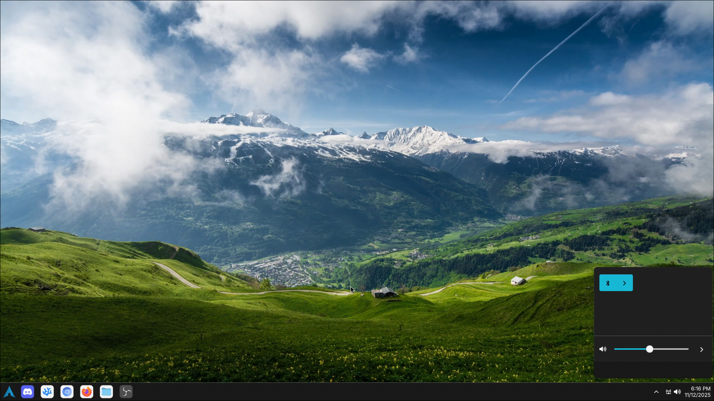

## Description
The desktop environment for Porthole, my custom linux distribution built on arch. Since this is built in quicksehll and mean for hyprland this desktop environment can be run seperatly from porthole. Simply follow the installation instructions below.

## Install steps
1. Install dependencies using your favorite package manager
2. Download the zip file and extract it
3. Place the extracted contents into ~/.config/quickshell/porthole
4. Launch with "quickshell --config porthole"

## Dependencies
 - quickshell
 - hyprland
 - pipewire
 - ttf-inter
 - ttf-nerd-fonts-symbols
 - Upower-git

